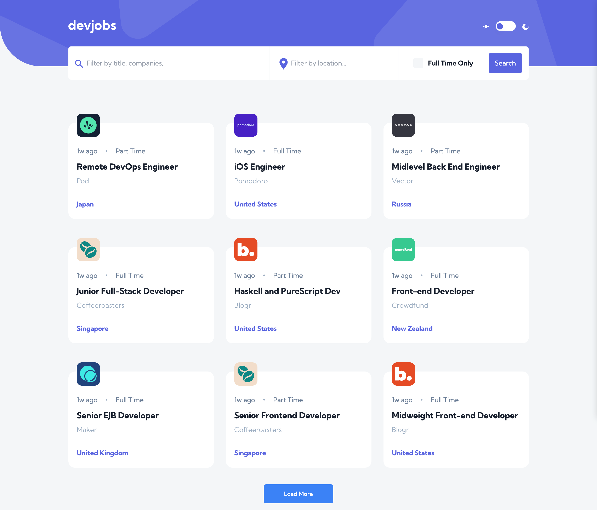

# Devjobs web app

A jobs board that pulls data from a postgresSQL database.

## Users can

- View the optimal layout for each page depending on their device's screen size
- See hover states for all interactive elements throughout the site
- Be able to filter jobs on the index page by title, location, and whether a job is for a full-time position
- Be able to click a job from the index page so that they can read more information and apply for the job

## Built with

- [Next.js]() - A react.js framework
- [Typescript]() - A JavaScript framework
- [Tailwindcss]() - For styling
- [Subapase](https://supabase.com/) - For the Postgres database
- [React Hook Form](https://react-hook-form.com/) - Better way to handle forms
- [headlessui](https://headlessui.com/) - Modals
- [React query](https://tanstack.com/query/v3/) - For handling data
- [Zod](https://github.com/colinhacks/zod) - Form validation
- [Axios](https://www.npmjs.com/package/axios) - Promise based HTTP client

## Links

- Code: [Github](https://github.com/Sana-Shabeel/devjobs)
- Live site: [Vercel](https://devjobs-nu.vercel.app/)

## Screenshot

